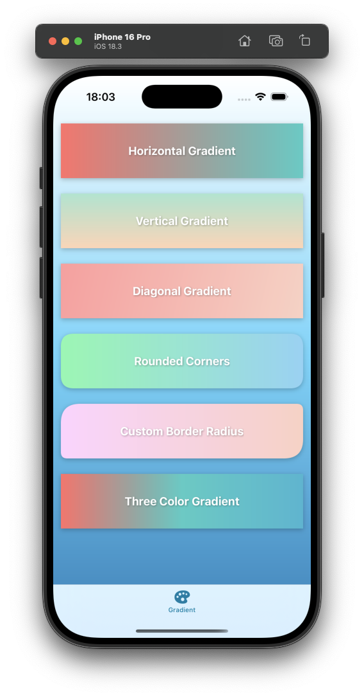

# React Native Gradient Background Skia

A high-performance linear gradient component for React Native using Skia.



## Why?

This package was created to address the limitations and maintenance issues with `react-native-linear-gradient`. While `react-native-linear-gradient` has been widely used, it has several drawbacks:

- Not actively maintained for the latest React Native versions
- Performance issues with complex gradients
- Limited support for modern React Native features
- Inconsistent behavior across different platforms

`react-native-gradient-background-skia` solves these problems by:

- Using Skia, a high-performance 2D graphics library
- Providing better performance for complex gradients
- Ensuring consistent behavior across platforms
- Being actively maintained for the latest React Native versions

## Features

- 🚀 High performance using Skia
- 🎨 Smooth gradient transitions
- 📱 Full screen background support
- 🔄 Multiple gradient directions (horizontal, vertical, diagonal)
- ⚡️ Customizable border radius
- 🎯 Support for multiple color stops
- 🌈 Beautiful color combinations

## Installation

```bash
npm install react-native-gradient-background-skia
# or
yarn add react-native-gradient-background-skia
```

## Usage

```tsx
import GradientBackgroundSkia from 'react-native-gradient-background-skia';

// Basic usage
<GradientBackgroundSkia
  colors={['#FF6B6B', '#4ECDC4']}
  style={styles.gradient}
>
  <View style={styles.content}>
    <Text>Your content here</Text>
  </View>
</GradientBackgroundSkia>

// Vertical gradient
<GradientBackgroundSkia
  colors={['#A8E6CF', '#FFD3B6']}
  start={{ x: 0, y: 0 }}
  end={{ x: 0, y: 1 }}
  style={styles.gradient}
>
  <View style={styles.content}>
    <Text>Vertical gradient</Text>
  </View>
</GradientBackgroundSkia>

// Diagonal gradient with custom border radius
<GradientBackgroundSkia
  colors={['#FF9A9E', '#FAD0C4']}
  start={{ x: 0, y: 0 }}
  end={{ x: 1, y: 1 }}
  borderRadius={20}
  style={styles.gradient}
>
  <View style={styles.content}>
    <Text>Diagonal gradient with rounded corners</Text>
  </View>
</GradientBackgroundSkia>

// Three color gradient
<GradientBackgroundSkia
  colors={['#FF6B6B', '#4ECDC4', '#45B7D1']}
  style={styles.gradient}
>
  <View style={styles.content}>
    <Text>Three color gradient</Text>
  </View>
</GradientBackgroundSkia>
```

## Props

| Prop                    | Type                     | Default        | Description                           |
| ----------------------- | ------------------------ | -------------- | ------------------------------------- |
| colors                  | string[]                 | -              | Array of colors for the gradient      |
| start                   | { x: number, y: number } | { x: 0, y: 0 } | Starting point of the gradient        |
| end                     | { x: number, y: number } | { x: 1, y: 0 } | Ending point of the gradient          |
| borderRadius            | number                   | 0              | Border radius for all corners         |
| borderTopLeftRadius     | number                   | 0              | Border radius for top left corner     |
| borderTopRightRadius    | number                   | 0              | Border radius for top right corner    |
| borderBottomLeftRadius  | number                   | 0              | Border radius for bottom left corner  |
| borderBottomRightRadius | number                   | 0              | Border radius for bottom right corner |
| style                   | ViewStyle                | -              | Additional styles for the container   |

## Example

Check out the example project in the `example` directory for a complete implementation showcasing various gradient styles and configurations.

## Contributing

Contributions are welcome! Please feel free to submit a Pull Request.

## License

MIT
